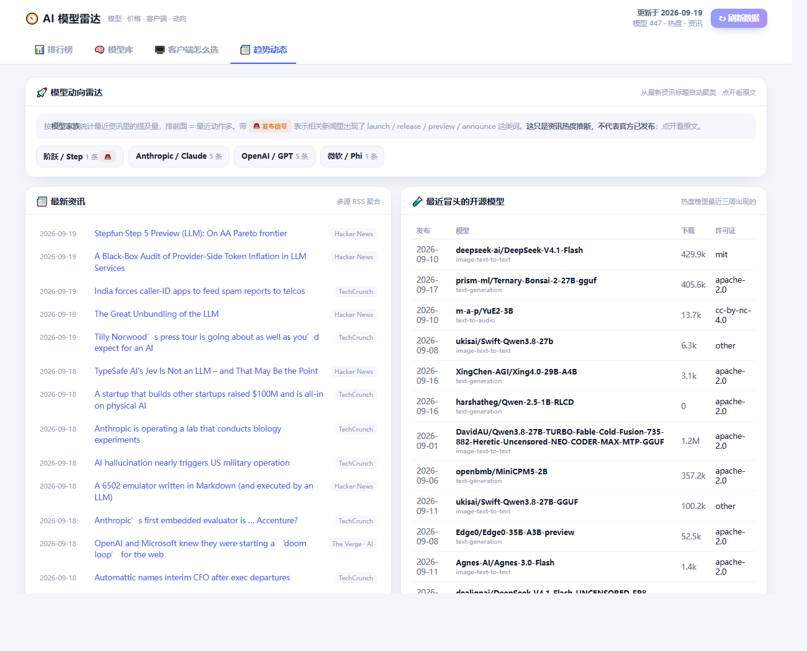

# 🧭 AI 模型雷达 (AILens)

> **English** — A zero-dependency, self-hosted dashboard for LLM selection.
> It pulls live data from OpenRouter, Hugging Face, GitHub and multiple news feeds, normalizes it,
> caches it on disk with graceful fallback, and answers one practical question:
> *which model should I run for each of my tasks, what's the fallback, and what does it cost per month?*
> Built on Node 22's native `http` + `fetch` — no frameworks, no build step.
> Chinese docs below.

一个**零依赖、本地运行**的大模型决策面板：实时拉取 OpenRouter / Hugging Face / GitHub / 多源资讯，
把「模型价格、能力、免费额度、厂商接口」放在一个页面里，并在此基础上回答一个更实际的问题——

> **我这台机器上的这些活儿，该用哪个模型、备胎是谁、一个月要花多少钱？**



## 功能

| 页面 | 干什么 |
|---|---|
| 📊 排行榜 | 性价比榜（每百万 token 价格）、开源热度榜、最新上线、模型梯队速查 |
| 🔍 模型库 | 400+ 模型，按 开源/闭源、厂商、免费、推理、视觉、工具调用 筛选；点开看价格/上下文/知识截止/推荐客户端 |
| 💻 客户端怎么选 | 14 个客户端 × 10 类模型支持矩阵 + 8 种典型场景的组合建议 |
| 📰 趋势动态 | 从多源资讯自动统计「哪家最近动作多」、最新开源模型、仓库发布记录 |
| 🛰️ 免费接口 | 7 家聚合/路由厂商的 API 端点速查 + 免费模型实时列表（支持按模型厂商 / 按提供商双分类） |
| 🧭 使用方案 | **本机任务画像 → 实时价格 → 路由表 / 月度成本 / Fallback 链 / 提供商建议**，带「省钱 ↔ 能力」滑块；画像可在界面内备份 / 重算 / 还原 |

## 「使用方案」页在算什么

1. 你在 `profile.local.mjs` 里描述自己平时拿大模型干什么（任务类型、上下文需求、
   日均次数、单次 token 量、预计缓存命中率、隐私要求）；
2. 雷达拿这份画像，在**实时拉到的模型价格**里逐任务打分排序，得出：
   - **路由总表**：每个任务的主力 / 备选 1 / 备选 2 / 免费兜底 / 本地兜底
   - **月度成本**：按缓存命中折算的真实支出，对比你的预算上限
   - **Fallback 链**：限流、超额、上下文超限、断网时依次切给谁（附可复制的网关配置）
3. 拖动「省钱 ↔ 能力」滑块，所有结论实时重算。

### 几个实测才踩得到的坑（已内置处理）

- OpenRouter 的**路由型模型**（`openrouter/auto` 等）`pricing.prompt` 是哨兵值 `-1000000`，
  意为"价格随它实际调度的模型浮动"——参与比价会把最便宜榜打穿，已剔除；
- 单次调用成本是美元级小数，`log(1+c)` 归一化会让**贵 20 倍的模型价格分只差 0.002**，
  必须用 `log(c)` 比值才有区分度；
- **档位正则要先看降级后缀再看系列名**，否则 `glm-5.3-flashx` 会被系列名里的 `glm-5` 误判成旗舰；
- `:batch` 变体是异步批处理（结果可能 24h 内返回），交互式用法不应入选。

## 自动更新

启动后不用管，三件事会自动发生：

1. **启动即刷** —— 服务先监听、再在后台拉一次全量数据。浏览器打开时若这次还没抓完，会复用同一次结果（并发锁），不会重复抓两遍。
2. **常驻定时** —— 每 6 小时自动重抓一次，失败自动降级到磁盘缓存。
3. **页面跟随** —— 页面每 5 分钟查一次（仅页面可见时），发现服务端有新数据或画像被改过就自动重渲染，不打断阅读位置。

行为可用环境变量覆盖，不用改代码：

```bash
AILENS_START_REFRESH=stale|always|off   # 启动策略，默认 stale（缓存超 10 分钟才重抓）
AILENS_STALE_MIN=10                     # stale 模式下"缓存还算新"的分钟数
AILENS_AUTO_HOURS=6                     # 定时重抓间隔，设 0 关闭
```

改完任务画像**不用重启服务**：服务端按文件 mtime 热加载。

## 「任务画像」怎么维护

分层设计，别搞反：

- **慢变层（人工标定，脚本不动）** —— `needCtx`、工具/推理/视觉、`privacy`、`priceWeight`、单次 token。
  这是"这类活需要什么能力"，机器判断不了。
- **快变层（可自动）** —— 每类任务的日均调用次数与证据文件名。

想自动重算快变层，两种方式：

```bash
node profile-scan.mjs           # 写入（旧文件备份为 profile.local.mjs.bak）
node profile-scan.mjs --dry     # 只打印对比，不写
node profile-scan.mjs --days=30 # 统计窗口从默认 14 天改成 30 天
```

或在「使用方案」页直接点工具条上的 🗂 备份 / 👀 预览重算 / ↩ 还原 —— 备份放在 `backups\`（带时间戳，已 gitignore）。
Windows 也可以双击 `重算画像.cmd`。

## 快速开始

需要 [Node.js 22+](https://nodejs.org)（仅标准库，**零 npm 依赖**）。

```bash
# 方式一：Windows 双击
run.cmd

# 方式二：任意平台
node server.mjs
# 然后浏览器打开 http://localhost:8765
```

## 隐私设计

「使用方案」页需要描述你的任务画像，但**这份画像不该被上传**。所以：

```
profile.example.mjs   ← 通用示例，进 Git
profile.local.mjs     ← 你的真实画像，被 .gitignore 忽略，永远不提交
```

服务端优先加载 `profile.local.mjs`，找不到才退回示例。把示例复制一份改名即可开始定制，
代码不用动。

## 项目结构

```
AILens/
├─ server.mjs           数据服务：抓取 + 缓存 + 归一化 + 静态托管（Node 22，零依赖）
├─ start.mjs            等服务就绪后打开浏览器
├─ public/index.html    单文件前端面板
├─ profile.example.mjs  任务画像通用示例
├─ profile.local.mjs    你的真实画像（gitignore）
├─ profile-scan.mjs     任务画像自动重算（扫本机日志与产物，零依赖）
├─ 重算画像.cmd          Windows 双击入口（先预览再写入）
├─ push-via-api.mjs     github.com 被封时的备用推送（走 GitHub Data API，见下）
├─ run.cmd              启动器（自适应路径）
├─ sync.cmd             一键 commit + push
├─ backups/             画像备份（gitignore，含个人信息）
└─ cache/               抓取缓存（断网自动降级用旧数据，gitignore）
```

## 推送：github.com 被封时的备用通路

某些网络下 `github.com:443` 直连被阻断、代理也会 502，但 `api.github.com` 仍然可达。
这时 `git push` 无论怎么重试都推不上去，可以改用 GitHub 的 Git Data API：

```bash
node push-via-api.mjs "your commit message"
```

它做的事：把每个文件以 **base64** 建 blob（直接传文本会破坏 GBK 编码的 .cmd），
以远端 tree 为 `base_tree` 建新 tree（保证其它文件不被清空）、建 commit、强制移动 ref，
最后在本地用相同 tree / parent / 作者 / 时间重建同一个提交，让 `HEAD` 与 `origin/master` 对齐。

前提：本机装了 [GitHub CLI](https://cli.github.com/) 且已 `gh auth login`。
`sync.cmd` 会先试直连、再试代理，都失败时调用它。

## 数据源

- [OpenRouter](https://openrouter.ai/api/v1/models) —— 模型清单与实时价格（无需 Key）
- [hf-mirror.com](https://hf-mirror.com) —— Hugging Face 镜像，开源热度榜
- GitHub Releases —— 关注的模型仓库发布记录
- 多源 RSS —— 模型动向雷达的资讯流
- 汇率 API —— 美元报价换算人民币

所有抓取带磁盘缓存：断网时自动用上一次的数据，页面右上角会标注「缓存」。

## 已知限制

- 模型「能力分」是**启发式**的（从命名、厂商、上架时间推断），本程序不伪造跑分；
  需要 LMArena 等权威榜单时，页面提供了浏览器直达按钮。
- 免费模型数量、价格、额度会随时变动，结论只在抓取时点有效。
- `profile-scan.mjs` 统计的是**日志提及热度，不是精确调用次数**，而且日志天然只记大事
  （日常短问答不会被记下来）。所以它做了几层约束：只统计条目行、泛词降权、同日同类封顶、
  50/50 平滑、单次变化限幅、归一化回总量，并且「轻量杂活」这类不写日志的任务始终沿用人工值。
  它保证画像不会僵死，但**不代表**比人工标定更准 —— 每次写入前请看一眼 `--dry` 的对比表。

## License

[MIT](LICENSE)
